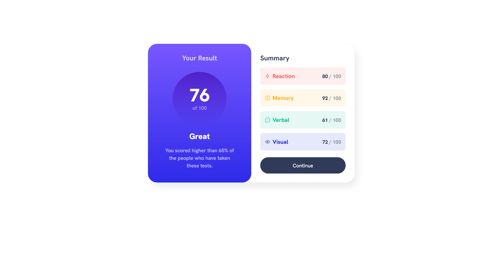
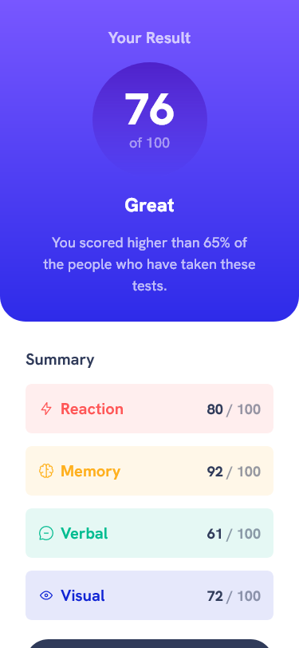

  

  <h1 align="center">Results Summary Component</h1>
  

    <a href="https://www.frontendmentor.io/challenges/results-summary-component-CE_K6s0maV"><strong>Results Summary Component</strong></a>
     
     
    <a href="https://gleeful-faloodeh-ca8211.netlify.app/">View Demo</a>
    ·
    <a href="https://www.frontendmentor.io/solutions/responsive-results-summary-component-scss-PHxkt1lu6t" target="_blank">Leave a comment</a> 
  

<!-- Badges -->

  <!-- Profile -->
  
  <!-- Status -->
    

#

This is a solution to the [Results Summary Component](https://www.frontendmentor.io/challenges/results-summary-component-CE_K6s0maV). Frontend Mentor challenges help you improve your coding skills by building realistic projects.

<h2 align="center">Links</h2>

- Solution URL: [https://www.frontendmentor.io/solutions/responsive-results-summary-component-scss-PHxkt1lu6t](https://www.frontendmentor.io/solutions/responsive-results-summary-component-scss-PHxkt1lu6t)
- Live Site URL: [https://gleeful-faloodeh-ca8211.netlify.app/](https://gleeful-faloodeh-ca8211.netlify.app/)

 

## Table of contents

- [Overview](#overview)
  - [The challenge](#the-challenge)
- [My process](#my-process)
  - [Built with](#built-with)
- [Author](#author)

## Overview

### The challenge

Users should be able to:

- View the optimal layout depending on their device's screen size
- See hover and focus states for all interactive elements on the page

## My process

I will start with the style-guide.md file. Then I will try to gauge what fonts and units were used in which areas awhile making my custom properties.

I did not run into any issues with this project, I did find a bit of trouble towards the end with my results page having a bit too much space at the bottom above the text, I thought as I had made the rest of the project the sizing would change by itself but it did not, so I just used some margin-top.

If somebody perhaps could see why that happened and what I could have done differently I would not mind hearing it.

This was also my first project in which I implemented SCSS (or SASS) in my work, I did a bit of research in the best layouts to use and I so far have enjoyed using it more and more, it feels like it takes a bit more time for me to set up everything compared to just using pure CSS but I enjoy the organization :)

My one issue was the tiny corner borders in the summary items, after some research I could not find a definitive way of using them that felt right. The idea of having to add 3-4 different divs to each summary item to make a border seemed a lot of pointless work, obviously there is a way to do it as the example photo shows so if anyone knew how to do them I would really like to know.

This was also my first project in which I implemented SCSS (or SASS) in my work, I did a bit of research in the best layouts to use and I so far have enjoyed using it more and more, it feels like it takes a bit more time for me to set up everything compared to just using pure CSS but I enjoy the organization, if anybody more tuned to SASS had any tips for me or how I could use it better I would appreciate it :)

Any overall feedback would be appreciated as well!
### Built with

<!-- Badges -->

- Semantic HTML5 markup
- [SCSS (Sass)](https://sass-lang.com/)
- [Prettier (CSS Formatter)](https://prettier.io/)
- [Visual Studio Code (Editor)](https://code.visualstudio.com/)

## Author

- Frontend Mentor - [@TanDevv](https://www.frontendmentor.io/profile/TanDevv)
